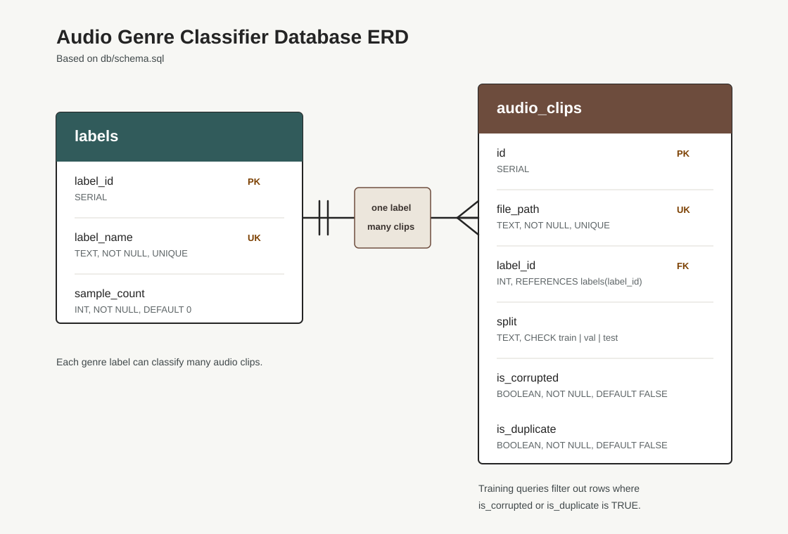
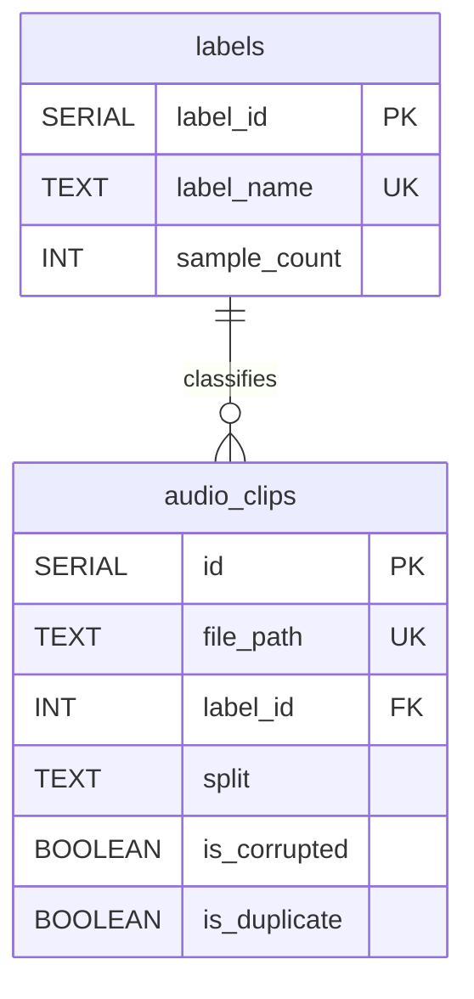

# Database ERD

This ERD is based on [`db/schema.sql`](../db/schema.sql).





## Entities

### `labels`

Stores one row per genre label.

| Column | Type | Constraint | Description |
|---|---|---|---|
| `label_id` | `SERIAL` | Primary key | Unique database ID for each genre |
| `label_name` | `TEXT` | Not null, unique | Genre name, such as `blues`, `jazz`, or `rock` |
| `sample_count` | `INT` | Not null, default `0` | Count of usable songs for that genre |

### `audio_clips`

Stores one row per raw `.wav` file.

| Column | Type | Constraint | Description |
|---|---|---|---|
| `id` | `SERIAL` | Primary key | Unique database ID for each audio file |
| `file_path` | `TEXT` | Not null, unique | Path to the `.wav` file relative to the repo root |
| `label_id` | `INT` | Not null, foreign key | References `labels.label_id` |
| `split` | `TEXT` | Not null, check constraint | Must be `train`, `val`, or `test` |
| `is_corrupted` | `BOOLEAN` | Not null, default `FALSE` | Flags files that should be excluded from training |
| `is_duplicate` | `BOOLEAN` | Not null, default `FALSE` | Flags duplicate files that should be excluded from training |

## Relationship

One genre label can classify many audio clips. Each audio clip belongs to exactly one label.

```text
labels.label_id 1 ---- many audio_clips.label_id
```

## View

`vw_split_summary` summarizes usable files by split:

```sql
SELECT split, COUNT(*) AS total_files
FROM audio_clips
WHERE is_corrupted = FALSE
  AND is_duplicate = FALSE
GROUP BY split
ORDER BY split;
```
